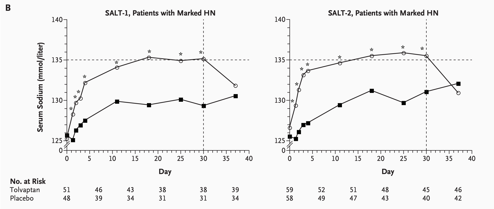
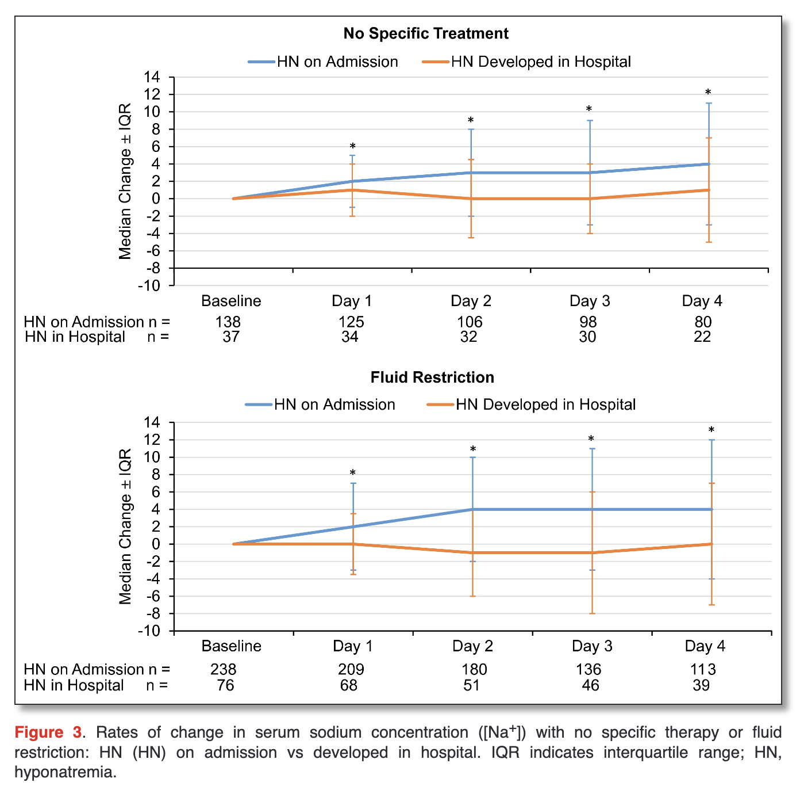
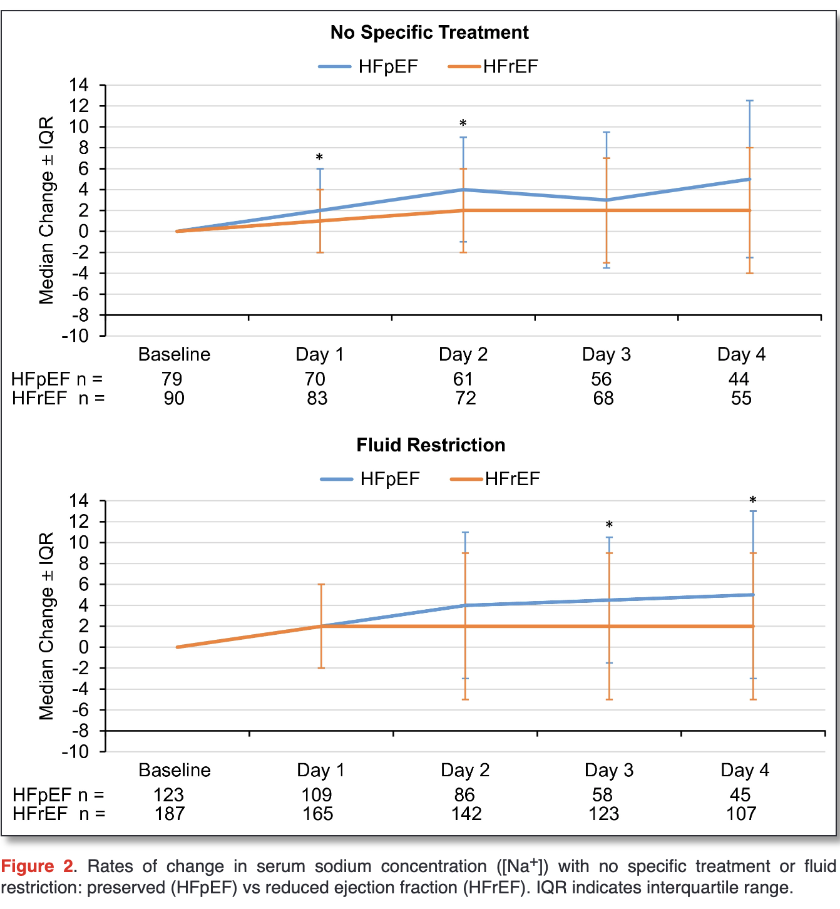

# Nephrology Consult on Hyponatremia x HFpEF
April 6th, 2023
Lahey Medical Center
Yilun Zhang 

---
# Case CC

85 yo woman w/ h/o HFpEF, AF, CKD stage G3b, PAD, inflammatory arthritis, hypothyroidism and OA. On mutliple diuretics **(s/p tolvaptan for 4 days last week)**, still hyponatremic at 120 w/o symptoms. Likely due to neurochemical changes from HFpEF and low solute intake.

---
<!-- _header: SALT NEJM 2006;355:2099-112 -->

---
# Recommendations
- **Asymptomatic** patients with chronic hyponatremia should be treated with *fluid restriction* and *diuretics*.
- Patients with chronic hypoonatremia who are **hyponatremic on admission** seem to respond better than those with acute hyponatremia.

<!-- _header: Current Management of Hyponatremia in Acute Heart Failure AHA 2017 -->

---
# Recommendations
<!-- _header: Current Management of Hyponatremia in Acute Heart Failure AHA 2017 -->

- Patients w/ **HFpEF** seem to benefit significantly benefit from *fluid restriction* over those with HFrEF.
- Also have more rapid rates of change, which is likely to be more clinically meaningful. 
---
# Recommendations
<!-- _header: SALT NEJM 2006;355:2099-112 -->

- *15mg tolvaptan daily*, consider increase to 30mg if no response after 24 hours w/ careful monitoring of serum sodiums
  - can also consider hypertonic saline + loop diuretics if no response
- Monitor for improvements at *Day 4* and *Day 30*
- Consider monitoring LFTs for hepatoxicity from tolvaptan
  - **Cannot continue after Day 30 due to toxicity**
---
# Recommendations for CC
- **Asymptomatic** patients with chronic hyponatremia should be treated with *fluid restriction* and *diuretics*.
- Patients with chronic hypoonatremia who are **hyponatremic on admission** seem to respond better than those with acute hyponatremia.
- Patients w/ **HFpEF** seem to benefit significantly benefit from *fluid restriction* over those with HFrEF.
- Also have more rapid rates of change, which is likely to be more clinically meaningful. 
- *15mg tolvaptan daily*, consider increase to 30mg if no response after 24 hours w/ careful monitoring of serum sodiums
- Monitor for improvements at *Day 4* and *Day 30*
- Consider monitoring LFTs for hepatoxicity from tolvaptan
  - **Cannot continue after Day 30 due to toxicity**
