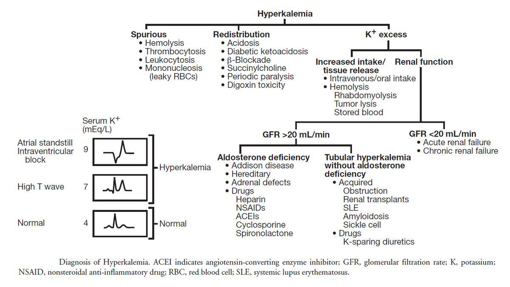

# Hyperkalemia
March 30th, 2023
Lahey Medical Center
Yilun Zhang 

---
# Physiology

---
# Etiology

The most common causes of hyperkalemia include:

* hyporeninemic hypoaldosteronism (type 4 [hyperkalemic distal] RTA; commonly seen among patients with diabetes)
* acute and chronic kidney failure
* low urine flow states
* medications (ACE inhibitors, ARBs, potassium-sparing diuretics, pentamidine, trimethoprim-sulfamethoxazole, and cyclosporine)
potassium shifts (rhabdomyolysis, hemolysis, hyperosmolality, insulin deficiency, β-adrenergic blockade, and metabolic acidosis)

---

---
# EKG Findings
* earliest change = peaked T waves + short QT interval
    * later changes:
        - PR prolongation
        - loss of P-waves
        - widening of QRS w/ "sine wave" pattern

> :star: Significant hyperkalemia associated with a normal ECG suggests *pseudohyperkalemia*.

---
# Treatment 

## Serum >6.5 
*OR if K>5.5 + AKI + tissue breakdown/inc. K+ absorption (GI bleeding)*
**Hyperkalemic Emergency!**
- IV calcium gluconate
- insulin + glucose/dextrose
- high-dose nebulized albuterol
- consider:
    - hemodialysis
    - GI cation exchangers
    - diuretics

## Serum >5.5
- dietary modification
- loop diuretics (patients w/o severe kidney impairment)
- bicarbonate (if acidotic)
- removing any risk factors (NSAIDs, correcting volume, etc...)

---
# Further Management
- Contiunous cardiac monitoring and serial echocardiograms
- Repeat K+ shortly after initiating treatment 
- Avoiding episodes of fasting
- Avoidance of drugs typically known to increase K+
    - Drugs that &darr; aldosterone drive
        - ACE, ARBs, etc...
    - Beta blockers
    - Impair K+ excretion (NSAIDS)

---
# Review Questions

---
# Q1

A 46-year-old woman is evaluated during a follow-up visit for hypertension, type 2 diabetes mellitus, and stage G3 chronic kidney disease. She reports no symptoms. Medications are losartan, amlodipine, metformin, canagliflozin, and rosuvastatin.

On physical examination, blood pressure is 124/72 mm Hg. Other vital signs and the remainder of the examination are unremarkable.

Labs are Cr 1.6, Na 136, K 5.6, Cl 104, Bicarb 24, Urine Albumin-creatinine ratio 320. 

ECG is normal.
The patient is counseled to start a low potassium diet.

- A. Add hydrochlorothiazide
- B. Add patiromer
- C. Administer intravenous calcium gluconate
- D. No further treatment 

## 

---
# A1

A 46-year-old woman is evaluated during a follow-up visit for hypertension, type 2 diabetes mellitus, and stage G3 chronic kidney disease. She reports no symptoms. Medications are losartan, amlodipine, metformin, canagliflozin, and rosuvastatin.

On physical examination, blood pressure is 124/72 mm Hg. Other vital signs and the remainder of the examination are unremarkable.

Labs are Cr 1.6, Na 136, K 5.6, Cl 104, Bicarb 24, Urine Albumin-creatinine ratio 320. 

ECG is normal.
The patient is counseled to start a low potassium diet.

- ~~A. Add hydrochlorothiazide~~
- B. Add patiromer
- ~~C. Administer intravenous calcium gluconate~~
- ~~D. No further treatment~~ Even though K is only moderately elevated, serum >5 = &uarr; morbidity/mortality 

Add patiromer
Potassium binders such as patiromer and sodium zirconium cyclosilicate can be used to treat hyperkalemia in patients with chronic kidney disease.

Use of potassium binders in patients with chronic kidney disease may allow continuation of essential medications, such as inhibitors of the renin-angiotensin system.

## 

---

##  Q2
A 62-year-old man is brought to the hospital because of a 12-hour history of worsening upper abdominal pain. He has osteoarthritis, hyperlipidemia, and hypertension. Current medications include enalapril, simvastatin, and over-the-counter ibuprofen therapy as needed. His vital signs are within normal limits. Temperature is 38.1°C (100.6°F), pulse is 89/min, respirations are 24/min, and blood pressure is 132/88 mm Hg. Abdominal examination shows right upper quadrant tenderness with mild guarding; there is no rebound or rigidity. The remainder of the examination, including neurologic examination, shows no abnormalities. Ultrasonography of the abdomen confirms the diagnosis of acute calculous cholecystitis. Administration of intravenous fluids and analgesics is begun. Treatment with cefoxitin is initiated and laparoscopic cholecystectomy in the next 2–3 days is planned. 

ECG shows a regular sinus rhythm and no acute abnormalities. A repeat serum study shows a potassium concentration of 5.8 mEq/L. 

Which of the following is the most appropriate next step in the management of this patient's hyperkalemia?

- A. Maintenance Fluid Therapy
- B. Sodium bicarbonate 
- C. Insulin and Glucose
- D. Sodium polystyrene sulfonate therapy
- E. Calcium gluconate
- F. Hemodialysis

## 

---

##  A2
A 62-year-old man is brought to the hospital because of a 12-hour history of worsening upper abdominal pain. He has osteoarthritis, hyperlipidemia, and hypertension. Current medications include enalapril, simvastatin, and over-the-counter ibuprofen therapy as needed. His vital signs are within normal limits. Temperature is 38.1°C (100.6°F), pulse is 89/min, respirations are 24/min, and blood pressure is 132/88 mm Hg. Abdominal examination shows right upper quadrant tenderness with mild guarding; there is no rebound or rigidity. The remainder of the examination, including neurologic examination, shows no abnormalities. Ultrasonography of the abdomen confirms the diagnosis of acute calculous cholecystitis. Administration of intravenous fluids and analgesics is begun. Treatment with cefoxitin is initiated and laparoscopic cholecystectomy in the next 2–3 days is planned. 

ECG shows a regular sinus rhythm and no acute abnormalities. A repeat serum study shows a potassium concentration of 5.8 mEq/L. 

Which of the following is the most appropriate next step in the management of this patient's hyperkalemia?

- A.Maintenance Fluid Therapy
- ~~B. Sodium bicarbonate~~
- ~~C. Insulin and Glucose~~
- ~~D. Sodium polystyrene sulfonate therapy~~
- ~~E. Calcium gluconate~~
- ~~F. Hemodialysis~~

This patient's hyperkalemia has most likely been caused by the combination of an ACE inhibitor (enalapril) and an NSAID (ibuprofen)
## 

